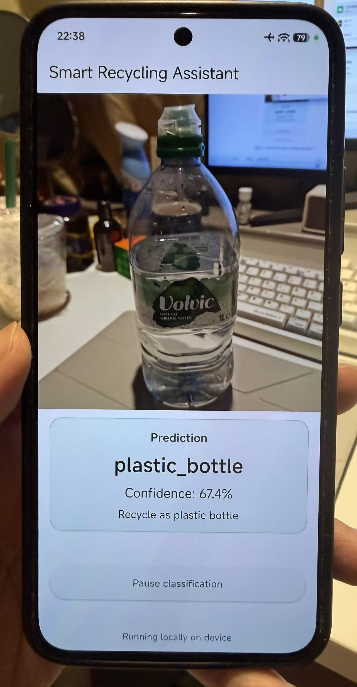
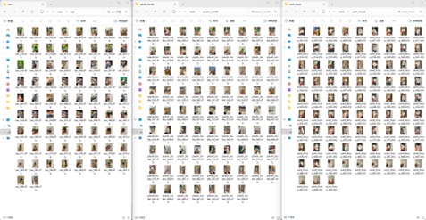
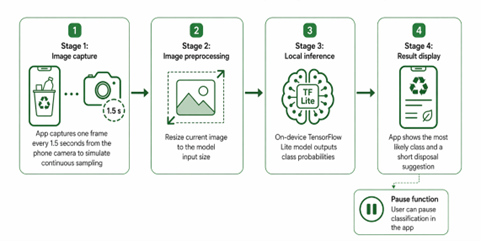
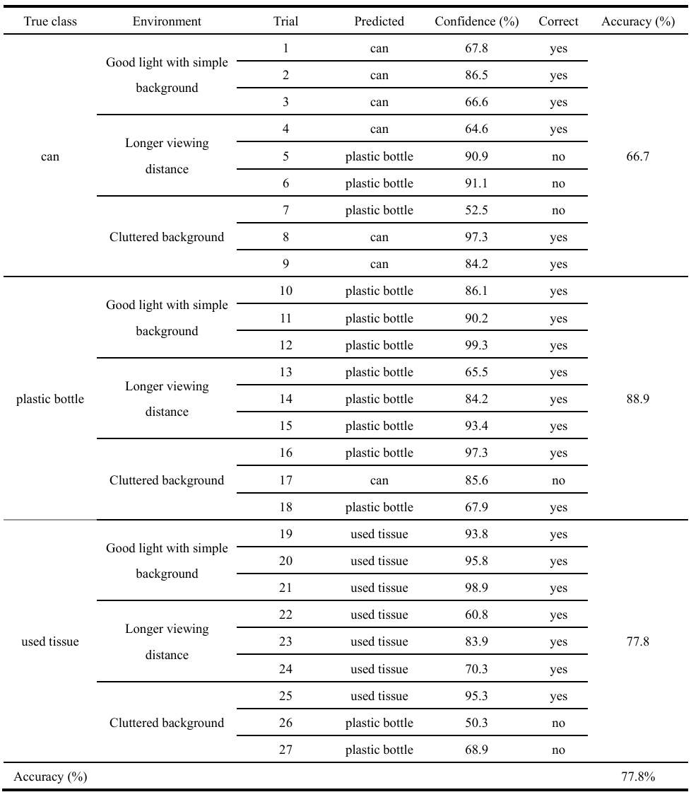

# Smart Recycling Assistant

A handheld edge-AI waste classification prototype that runs locally on an Android phone.

**Course:** CASA0018  
**Tools:** Edge Impulse, TensorFlow Lite, Flutter, Android Studio  
**Final platform:** Android phone  
**Classes:** `can`, `plastic_bottle`, `used_tissue`

  
  
<em>Figure 1. Final Android prototype showing live camera-based waste classification.</em>

## Overview

This project builds a lightweight mobile waste-classification system that uses the phone camera to identify common waste items in near real time. The final prototype runs locally on an Android device and outputs the predicted class, a confidence score, and a short disposal suggestion.

The project focuses on the full pipeline: custom data collection, model refinement, TensorFlow Lite export, Android deployment, and live testing on the final handheld device.

## Repository structure

- `android_app/` - Flutter Android app and deployment notes  
- `data/` - dataset folders and notes
- `edge_impulse/` - Edge Impulse export materials and notes  
- `media/` - figures, screenshots, and demo images  
- `experiment_log.md` - development and experiment history  
- `README.md` - project summary  

For detailed development steps, see `experiment_log.md`, `dataset_notes.md`, and `android_app/`.

## Dataset

The dataset was collected manually using a phone camera in indoor everyday environments. Images were taken under different angles, distances, lighting conditions, and background complexity.

Final classes:

- `can`
- `plastic_bottle`
- `used_tissue`

The project originally used a broader third class, `general_waste`, but this was later replaced with `used_tissue` because the original class was too visually inconsistent and reduced model performance.

  
  
<em>Figure 2. Representative dataset samples for can, plastic bottle, and used tissue.</em>

## Model

The project uses a transfer-learning image-classification pipeline in Edge Impulse.

Final model characteristics:

- MobileNetV2-based lightweight image classifier
- input size: `96 x 96 RGB`
- output classes: `3`
- exported as TensorFlow Lite (`.tflite`)

## Development summary

The model was refined through three main rounds:

- **Round 1:** baseline model using `can`, `plastic_bottle`, `general_waste`
- **Round 2:** replaced `general_waste` with `used_tissue`
- **Round 3:** added more difficult samples and increased training cycles

## Deployment / app

The final prototype was deployed as a custom Flutter Android app.

Current app features:

- live camera preview
- near-real-time local classification
- predicted label display
- confidence score display
- disposal suggestion
- pause / resume classification

Deployment pipeline:

1. train model in Edge Impulse  
2. export TFLite model  
3. integrate model into Flutter app  
4. run locally on Android phone  
5. classify the current camera scene on-device  

  
  
<em>Figure 3. System workflow from camera input to on-device waste classification output.</em>

## Performance

### Training-stage result
Final Edge Impulse validation result:

- Accuracy: **75.0%**
- Loss: **0.44**
- Weighted F1: **0.75**

### Live mobile evaluation
The completed Android prototype was tested in **27 live trials**:

- 3 classes
- 3 environmental conditions
- 3 repetitions each

Overall live mobile accuracy:

- **77.8%** (21 / 27)

By condition:

- Good light + simple background: **100.0%**
- Longer viewing distance: **77.8%**
- Cluttered background: **55.6%**

By class:

- `can`: **66.7%**
- `plastic_bottle`: **88.9%**
- `used_tissue`: **77.8%**

  
  
<em>Figure 4. Summary of live mobile evaluation results across conditions and classes.</em>

Main observation:

- the system worked well in controlled conditions
- performance dropped most in cluttered scenes
- the most common confusion was between `can` and `plastic_bottle`

## Key findings

- The largest improvement came from refining class design.
- Replacing `general_waste` with `used_tissue` improved the task definition and model performance.
- The final model was successfully deployed to a custom Android app.
- The app achieved **77.8%** live mobile accuracy.
- Background clutter was the strongest negative factor.
- The project demonstrates a full pipeline from custom dataset to handheld edge deployment.

## Limitations

- only three waste categories were included
- dataset size was relatively small
- cluttered backgrounds reduced performance
- the app uses periodic capture rather than full video-stream inference
- some wrong predictions still had high confidence
